# Actividad 3 – Kubernetes, Helm, ArgoCD & CI/CD

> **Curso:** Arquitectura de Software – Unisabana  
> **Tema:** Microservicios con Docker, Kubernetes, Helm y GitOps con ArgoCD  
> **Stack:** Node.js 20 · Express · TypeScript · Docker · Kubernetes · Helm · ArgoCD · GitHub Actions

---

## Integrantes

- Juan Carlos Forero Galindo
- Fernanda Rodriguez
- Santiago Lopez
- Sebastian Torres Acosta

---

## Estructura del repositorio

```
03_k8s/
├── microservice/                   # Código fuente del microservicio
│   ├── src/
│   │   └── index.ts                # API Express + TypeScript
│   ├── package.json
│   ├── tsconfig.json
│   ├── Dockerfile                  # Multi-stage build (builder + runtime)
│   └── .dockerignore
│
├── helm/
│   └── microservice-chart/         # Helm chart completo
│       ├── Chart.yaml
│       ├── values.yaml             # Valores por defecto (dev)
│       ├── values-prod.yaml        # Override para producción
│       └── templates/
│           ├── _helpers.tpl        # Funciones reutilizables
│           ├── deployment.yaml
│           ├── service.yaml
│           ├── ingress.yaml
│           └── hpa.yaml            # HorizontalPodAutoscaler
│
├── argocd/
│   ├── install-argocd.sh           # Script de instalación de ArgoCD
│   └── application.yaml            # CRD Application (GitOps)
│
├── diagrams/
│   ├── arquitectura.md             # Diagrama C4 – arquitectura general
│   ├── cicd-flow.md                # Diagrama de flujo CI/CD
│   └── k8s-componentes.md          # Diagrama de componentes K8s
│
└── .github/
    └── workflows/
        └── ci-cd.yaml              # Pipeline GitHub Actions
```

> Los diagramas están en `diagrams/` como bloques Mermaid independientes.

---

## Arquitectura general

Ver detalle en [`diagrams/arquitectura.md`](./diagrams/arquitectura.md).

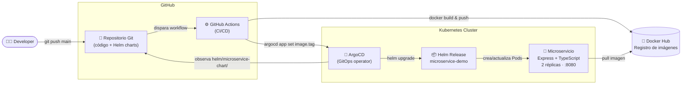

---

## Paso 1 – Microservicio Express + TypeScript

La app expone tres endpoints:

| Endpoint      | Descripción                              |
|---------------|------------------------------------------|
| `GET /`       | Info general del servicio y hostname     |
| `GET /health` | Health check (usado por K8s probes)      |
| `GET /items`  | Lista de items de ejemplo                |

**Probar localmente:**

```bash
cd microservice
npm install
npm run dev        # hot-reload con ts-node-dev
# curl http://localhost:8080/health

npm run build      # compila TypeScript → dist/
npm start          # ejecuta el build compilado
```

---

## Paso 2 – Docker

El `Dockerfile` usa **multi-stage build**: la primera etapa compila TypeScript, la segunda copia solo `dist/` y dependencias de producción, resultando en una imagen mínima.

### Construir y probar

```bash
cd microservice
docker build -t tu-usuario/microservice-demo:latest .

docker run -p 8080:8080 \
  -e SERVICE_VERSION=1.0.0 \
  tu-usuario/microservice-demo:latest

curl http://localhost:8080/health
# {"status":"ok","service":"microservice-demo","version":"1.0.0"}
```

### Publicar en Docker Hub

```bash
docker login
docker push tu-usuario/microservice-demo:latest
```

> **Nota:** sustituir `tu-usuario` por el usuario de Docker Hub correspondiente, o por la URL del registry utilizado (GHCR, ECR, etc.).

---

## Paso 3 – Kubernetes local (Minikube / Kind)

```bash
# Opción A: minikube
minikube start

# Opción A.1: minikube con driver docker (si se cuenta con Docker Desktop instalado)
minikube start --driver=docker

# Opción B: kind
kind create cluster --name k8s-demo

# Crear namespace
kubectl create namespace microservice

# Verificar que el clúster responde
kubectl get nodes
```

**Ejemplo:**

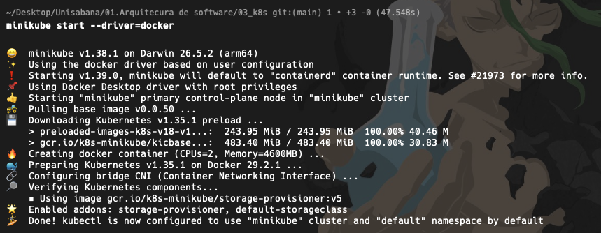

*Figura 1. `minikube start --driver=docker` levantando el clúster local.*

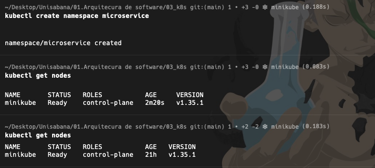

*Figura 2. Namespace `microservice` creado y `kubectl get nodes` confirmando que el clúster responde.*

---

## Paso 4 – Helm

Ver componentes K8s desplegados en [`diagrams/k8s-componentes.md`](./diagrams/k8s-componentes.md).

### Instalar con valores por defecto

```bash
helm install microservice-demo ./helm/microservice-chart \
  --namespace microservice \
  --set image.repository=tu-usuario/microservice-demo \
  --set image.tag=latest
```

**Ejemplo:**

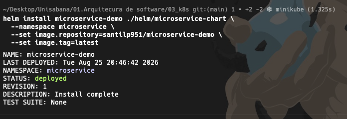

*Figura 3. `helm install` creando la release `microservice-demo` (REVISION: 1).*

### Override para producción

```bash
helm upgrade microservice-demo ./helm/microservice-chart \
  --namespace microservice \
  -f ./helm/microservice-chart/values-prod.yaml \
  --set image.tag=abc1234
```

**Ejemplo:**

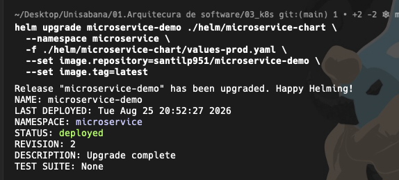

*Figura 4. `helm upgrade` aplicando el override de producción (REVISION: 2).*

### Verificar el despliegue

```bash
helm list -n microservice
kubectl get pods -n microservice
kubectl get svc -n microservice

# Port-forward para probar localmente
kubectl port-forward svc/microservice-demo-microservice-chart 8080:80 -n microservice
curl http://localhost:8080/health
```

**Ejemplo:**

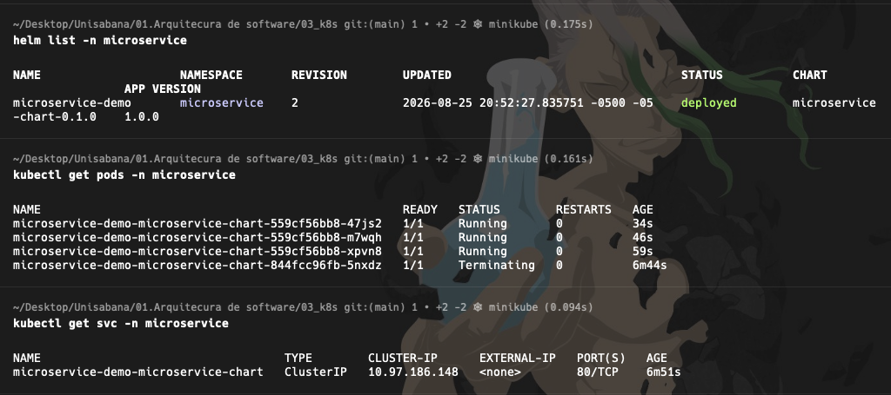

*Figura 5. `helm list`, `kubectl get pods` (3 réplicas por el override de prod) y `kubectl get svc`.*

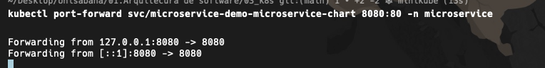

*Figura 6. `kubectl port-forward` exponiendo el Service en `localhost:8080`.*

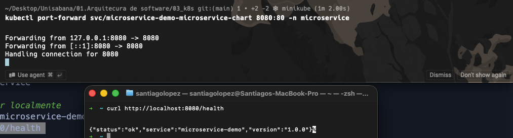

*Figura 7. `curl http://localhost:8080/health` respondiendo `{"status":"ok", ...}` a través del port-forward.*

### Desinstalar

```bash
helm uninstall microservice-demo -n microservice
```

---

## Paso 5 – ArgoCD

### Instalar en el clúster

```bash
chmod +x argocd/install-argocd.sh
./argocd/install-argocd.sh
```

El script crea el namespace `argocd`, aplica el manifiesto oficial, espera que el servidor esté listo e imprime la contraseña inicial de `admin`.

**Ejemplo:**

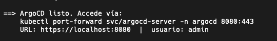

*Figura 8. Mensaje final de `install-argocd.sh`: ArgoCD listo y URL de acceso.*

### Obtener la contraseña del admin

ArgoCD genera una contraseña inicial aleatoria y la guarda como `Secret` de Kubernetes (no es un valor fijo). El script del paso anterior ya la imprime al final, pero si es necesario obtenerla nuevamente (o se perdió de vista en la salida), puede recuperarse de la siguiente manera:

```bash
kubectl get secret argocd-initial-admin-secret -n argocd \
  -o jsonpath="{.data.password}" | base64 -d && echo
```

> El valor viene en Base64 dentro del Secret (así es como Kubernetes guarda cualquier Secret), por eso hay que decodificarlo con `base64 -d` para leerlo en texto plano. Debe conservarse, ya que se utilizará en el paso siguiente para el inicio de sesión.

### Acceder a la UI

```bash
kubectl port-forward svc/argocd-server -n argocd 8080:443
# https://localhost:8080  |  usuario: admin
```

**Ejemplo:**

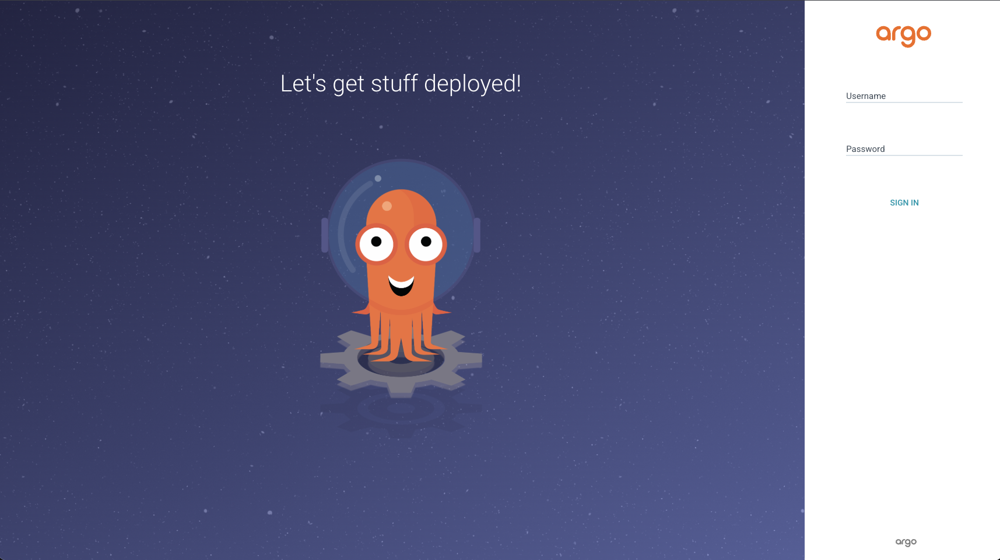

*Figura 9. Pantalla de login de la UI de ArgoCD en `https://localhost:8080`.*

### Configurar repositorio y desplegar

```bash
argocd login localhost:8080 --username admin --password <PASSWORD> --insecure
argocd repo add https://github.com/MAS-SABANA/MAS-01-ARQ-03-K8S.git

kubectl apply -f argocd/application.yaml

argocd app get microservice-demo
argocd app sync microservice-demo
```

Desde este punto ArgoCD **observa `main`** y sincroniza automáticamente cualquier cambio en `helm/microservice-chart/`.

**Ejemplo:**

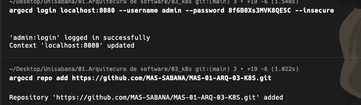

*Figura 10. `argocd login` autenticado con éxito y `argocd repo add` registrando el repositorio.*

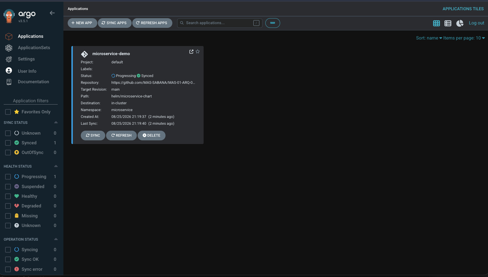

*Figura 11. La `Application` `microservice-demo` visible en el dashboard de ArgoCD, en estado Synced.*

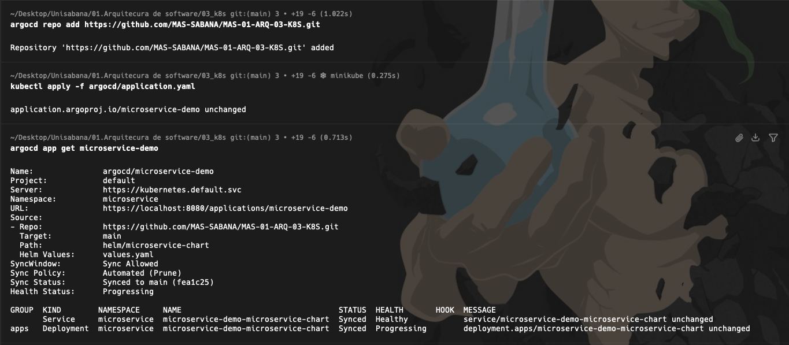

*Figura 12. `kubectl apply -f argocd/application.yaml` y detalle de `argocd app get microservice-demo`.*

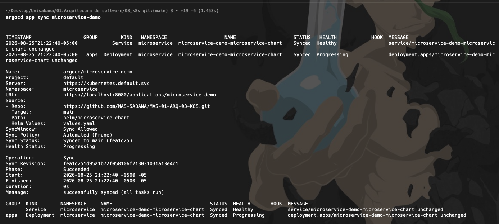

*Figura 13. `argocd app sync microservice-demo` sincronizado con éxito (`Phase: Succeeded`).*

---

## Paso 6 – Configuración de DigitalOcean

Hasta el Paso 5, ArgoCD corre únicamente en el clúster local (minikube), accesible solo desde la máquina en local. Para que el pipeline de CI/CD del **Paso 7** pueda desplegar de verdad (el job `deploy` corre en un runner de GitHub, no en la máquina local), ArgoCD necesita vivir en un clúster con una **dirección alcanzable desde internet**.

Este paso mueve ArgoCD de minikube a un clúster Kubernetes gestionado en la nube. La guía usa **DigitalOcean Kubernetes (DOKS)** como ejemplo (por sus créditos gratuitos y su simplicidad), pero el mismo procedimiento aplica a cualquier proveedor que se prefiera (GKE, EKS, AKS, un VPS con `k3s`, etc.) — lo único que cambia es cómo se crea el clúster; instalar ArgoCD, exponerlo y conectar el pipeline es igual en todos los casos.

Guía paso a paso completa: **[`docs/despliegue-digitalocean.md`](./docs/despliegue-digitalocean.md)**
Diagramas (local vs nube, infraestructura DOKS, secuencia completa): **[`diagrams/despliegue-digitalocean.md`](./diagrams/despliegue-digitalocean.md)**

Resumen de lo que cubre:

1. Crear cuenta y reclamar créditos gratuitos
2. Instalar `doctl` (CLI de DigitalOcean) y crear el clúster DOKS
3. Instalar ArgoCD en ese clúster (mismo script del Paso 5)
4. Exponer `argocd-server` con un `Service` tipo `LoadBalancer` (IP pública real)
5. Configurar `ARGOCD_SERVER` y `ARGOCD_PASSWORD` en GitHub con esos valores reales
6. **Borrar el clúster al terminar**, para no seguir consumiendo créditos

---

## Paso 7 – Pipeline CI/CD (GitHub Actions)

El pipeline en `.github/workflows/ci-cd.yaml` se dispara en cada **push a `main`** que toque `microservice/`, `helm/` o el propio workflow.

Ver diagrama completo en [`diagrams/cicd-flow.md`](./diagrams/cicd-flow.md).

### Flujo resumido


### Secrets requeridos en GitHub

En **Settings → Secrets and variables → Actions**, agregar:

| Secret               | Valor                              |
|----------------------|------------------------------------|
| `DOCKERHUB_USERNAME` | Usuario de Docker Hub              |
| `DOCKERHUB_TOKEN`    | Token de acceso de Docker Hub      |
| `ARGOCD_SERVER`      | IP o dominio del servidor ArgoCD   |
| `ARGOCD_PASSWORD`    | Contraseña del admin de ArgoCD     |

> ⚠️ `ARGOCD_SERVER` debe ser una dirección **alcanzable desde internet** — el job `deploy` corre en un runner de GitHub, no en la máquina local. Si ArgoCD solo vive en minikube (local), este job no puede conectarse. Guía paso a paso para desplegar ArgoCD en un clúster real y que el pipeline funcione de punta a punta: [`docs/despliegue-digitalocean.md`](./docs/despliegue-digitalocean.md).

---

## Requisitos previos

| Herramienta     | Versión mínima | Instalación |
|-----------------|----------------|-------------|
| Node.js         | 20+            | [nodejs.org](https://nodejs.org/) |
| Docker          | 24+            | [docs.docker.com](https://docs.docker.com/get-docker/) |
| kubectl         | 1.28+          | [kubernetes.io](https://kubernetes.io/docs/tasks/tools/) |
| Helm            | 3.14+          | [helm.sh](https://helm.sh/docs/intro/install/) |
| Minikube o Kind | cualquiera     | [minikube.sigs.k8s.io](https://minikube.sigs.k8s.io/) |
| ArgoCD CLI      | 2.10+          | [argo-cd.readthedocs.io](https://argo-cd.readthedocs.io/en/stable/cli_installation/) |

---

## Comandos útiles de referencia

```bash
# Ver todos los recursos en el namespace
kubectl get all -n microservice

# Ver logs del pod
kubectl logs -l app.kubernetes.io/name=microservice-chart -n microservice

# Escalar manualmente
kubectl scale deployment -l app.kubernetes.io/name=microservice-chart \
  --replicas=3 -n microservice

# Ver historial de Helm
helm history microservice-demo -n microservice

# Rollback Helm
helm rollback microservice-demo 1 -n microservice

# Estado de ArgoCD
argocd app list
argocd app get microservice-demo
```
