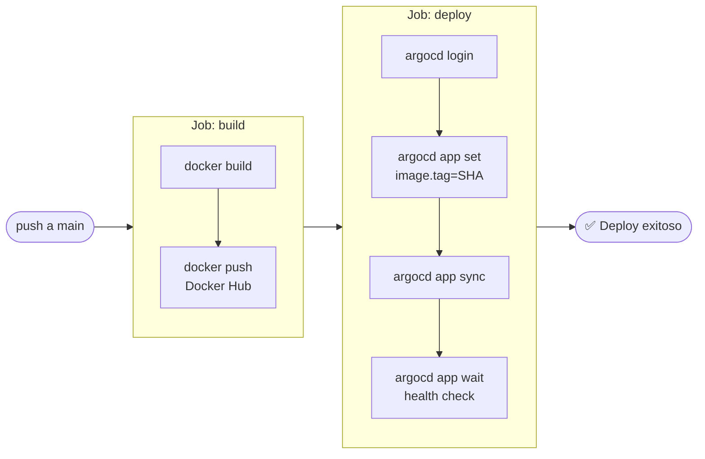

# Actividad 3 – Kubernetes, Helm, ArgoCD & CI/CD

> **Curso:** Arquitectura de Software – Unisabana  
> **Tema:** Microservicios con Docker, Kubernetes, Helm y GitOps con ArgoCD  
> **Stack:** Node.js 20 · Express · TypeScript · Docker · Kubernetes · Helm · ArgoCD · GitHub Actions

---

## Estructura del repositorio

```
03_k8s/
├── microservice/                   # Código fuente del microservicio
│   ├── src/
│   │   └── index.ts                # API Express + TypeScript
│   ├── package.json
│   ├── tsconfig.json
│   ├── Dockerfile                  # Multi-stage build (builder + runtime)
│   └── .dockerignore
│
├── helm/
│   └── microservice-chart/         # Helm chart completo
│       ├── Chart.yaml
│       ├── values.yaml             # Valores por defecto (dev)
│       ├── values-prod.yaml        # Override para producción
│       └── templates/
│           ├── _helpers.tpl        # Funciones reutilizables
│           ├── deployment.yaml
│           ├── service.yaml
│           ├── ingress.yaml
│           └── hpa.yaml            # HorizontalPodAutoscaler
│
├── argocd/
│   ├── install-argocd.sh           # Script de instalación de ArgoCD
│   └── application.yaml            # CRD Application (GitOps)
│
├── diagrams/
│   ├── arquitectura.md             # Diagrama C4 – arquitectura general
│   ├── cicd-flow.md                # Diagrama de flujo CI/CD
│   └── k8s-componentes.md          # Diagrama de componentes K8s
│
└── .github/
    └── workflows/
        └── ci-cd.yaml              # Pipeline GitHub Actions
```

> Los diagramas están en `diagrams/` como bloques Mermaid independientes.

---

## Arquitectura general

Ver detalle en [`diagrams/arquitectura.md`](./diagrams/arquitectura.md).


---

## Paso 1 – Microservicio Express + TypeScript

La app expone tres endpoints:

| Endpoint      | Descripción                              |
|---------------|------------------------------------------|
| `GET /`       | Info general del servicio y hostname     |
| `GET /health` | Health check (usado por K8s probes)      |
| `GET /items`  | Lista de items de ejemplo                |

**Probar localmente:**

```bash
cd microservice
npm install
npm run dev        # hot-reload con ts-node-dev
# curl http://localhost:8080/health

npm run build      # compila TypeScript → dist/
npm start          # ejecuta el build compilado
```

---

## Paso 2 – Docker

El `Dockerfile` usa **multi-stage build**: la primera etapa compila TypeScript, la segunda copia solo `dist/` y dependencias de producción, resultando en una imagen mínima.

### Construir y probar

```bash
cd microservice
docker build -t tu-usuario/microservice-demo:latest .

docker run -p 8080:8080 \
  -e SERVICE_VERSION=1.0.0 \
  tu-usuario/microservice-demo:latest

curl http://localhost:8080/health
# {"status":"ok","service":"microservice-demo","version":"1.0.0"}
```

### Publicar en Docker Hub

```bash
docker login
docker push tu-usuario/microservice-demo:latest
```

> **Reemplaza** `tu-usuario` con tu usuario de Docker Hub o la URL de tu registry (GHCR, ECR, etc.).

---

## Paso 3 – Kubernetes local (Minikube / Kind)

```bash
# Opción A: minikube
minikube start

# Opción A.1: minikube con driver docker (si ya tienes Docker Desktop instalado)
minikube start --driver=docker

# Opción B: kind
kind create cluster --name k8s-demo

# Crear namespace
kubectl create namespace microservice

# Verificar que el clúster responde
kubectl get nodes
```

Ver componentes K8s desplegados en [`diagrams/k8s-componentes.md`](./diagrams/k8s-componentes.md).

---

## Paso 4 – Helm

### Instalar con valores por defecto

```bash
helm install microservice-demo ./helm/microservice-chart \
  --namespace microservice \
  --set image.repository=tu-usuario/microservice-demo \
  --set image.tag=latest
```

### Override para producción

```bash
helm upgrade microservice-demo ./helm/microservice-chart \
  --namespace microservice \
  -f ./helm/microservice-chart/values-prod.yaml \
  --set image.tag=abc1234
```

### Verificar el despliegue

```bash
helm list -n microservice
kubectl get pods -n microservice
kubectl get svc -n microservice

# Port-forward para probar localmente
kubectl port-forward svc/microservice-demo-microservice-chart 8080:80 -n microservice
curl http://localhost:8080/health
```

### Desinstalar

```bash
helm uninstall microservice-demo -n microservice
```

---

## Paso 5 – ArgoCD

### Instalar en el clúster

```bash
chmod +x argocd/install-argocd.sh
./argocd/install-argocd.sh
```

El script crea el namespace `argocd`, aplica el manifiesto oficial, espera que el servidor esté listo e imprime la contraseña inicial de `admin`.

### Acceder a la UI

```bash
kubectl port-forward svc/argocd-server -n argocd 8080:443
# https://localhost:8080  |  usuario: admin
```

### Configurar repositorio y desplegar

```bash
argocd login localhost:8080 --username admin --password <PASSWORD> --insecure
argocd repo add https://github.com/TU-USUARIO/TU-REPO.git

# Editar argocd/application.yaml → repoURL con tu repo real
kubectl apply -f argocd/application.yaml

argocd app get microservice-demo
argocd app sync microservice-demo
```

Desde este punto ArgoCD **observa `main`** y sincroniza automáticamente cualquier cambio en `helm/microservice-chart/`.

---

## Paso 6 – Pipeline CI/CD (GitHub Actions)

El pipeline en `.github/workflows/ci-cd.yaml` se dispara en cada **push a `main`** que toque `microservice/`, `helm/` o el propio workflow.

Ver diagrama completo en [`diagrams/cicd-flow.md`](./diagrams/cicd-flow.md).

### Flujo resumido



### Secrets requeridos en GitHub

Ve a **Settings → Secrets and variables → Actions** y agrega:

| Secret               | Valor                              |
|----------------------|------------------------------------|
| `DOCKERHUB_USERNAME` | Tu usuario de Docker Hub           |
| `DOCKERHUB_TOKEN`    | Token de acceso de Docker Hub      |
| `ARGOCD_SERVER`      | IP o dominio del servidor ArgoCD   |
| `ARGOCD_PASSWORD`    | Contraseña del admin de ArgoCD     |

---

## Requisitos previos

| Herramienta     | Versión mínima | Instalación |
|-----------------|----------------|-------------|
| Node.js         | 20+            | [nodejs.org](https://nodejs.org/) |
| Docker          | 24+            | [docs.docker.com](https://docs.docker.com/get-docker/) |
| kubectl         | 1.28+          | [kubernetes.io](https://kubernetes.io/docs/tasks/tools/) |
| Helm            | 3.14+          | [helm.sh](https://helm.sh/docs/intro/install/) |
| Minikube o Kind | cualquiera     | [minikube.sigs.k8s.io](https://minikube.sigs.k8s.io/) |
| ArgoCD CLI      | 2.10+          | [argo-cd.readthedocs.io](https://argo-cd.readthedocs.io/en/stable/cli_installation/) |

---

## Comandos útiles de referencia

```bash
# Ver todos los recursos en el namespace
kubectl get all -n microservice

# Ver logs del pod
kubectl logs -l app.kubernetes.io/name=microservice-chart -n microservice

# Escalar manualmente
kubectl scale deployment -l app.kubernetes.io/name=microservice-chart \
  --replicas=3 -n microservice

# Ver historial de Helm
helm history microservice-demo -n microservice

# Rollback Helm
helm rollback microservice-demo 1 -n microservice

# Estado de ArgoCD
argocd app list
argocd app get microservice-demo
```
