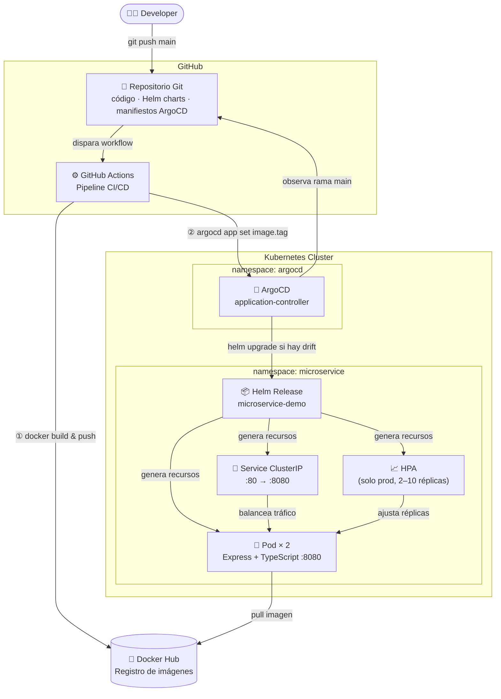
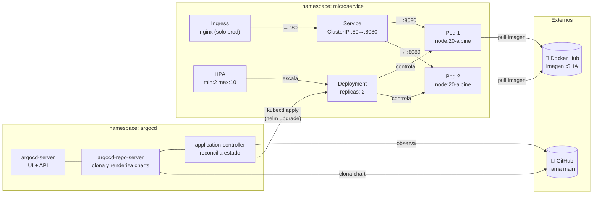

# Arquitectura General

Vista de alto nivel: actores, sistemas externos y clúster Kubernetes.

---

# Contenedores K8s – Vista interna del clúster

Detalle de cada objeto Kubernetes generado por el Helm chart.

