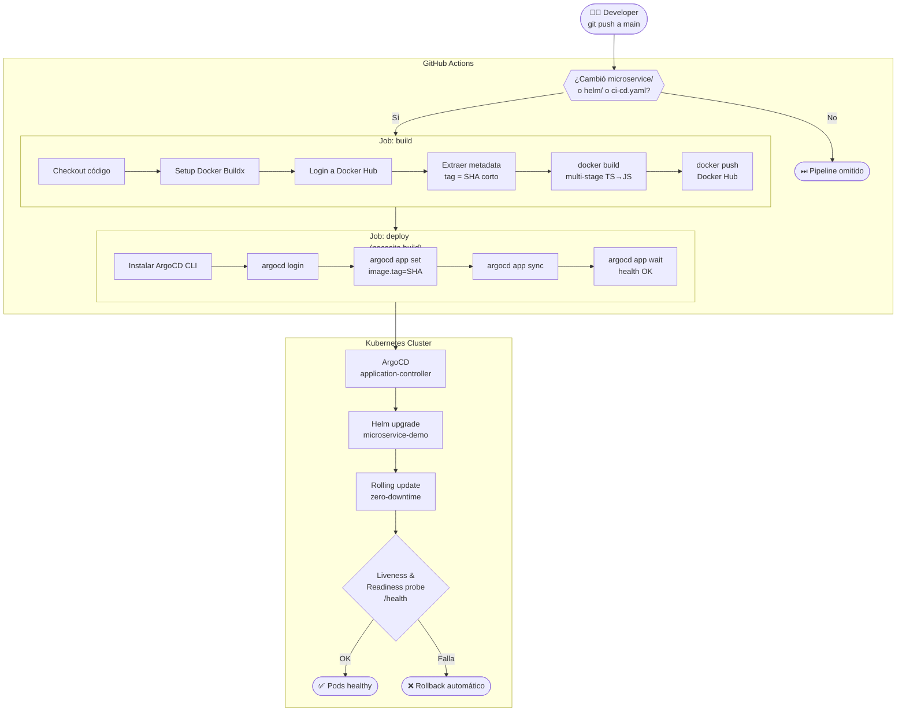
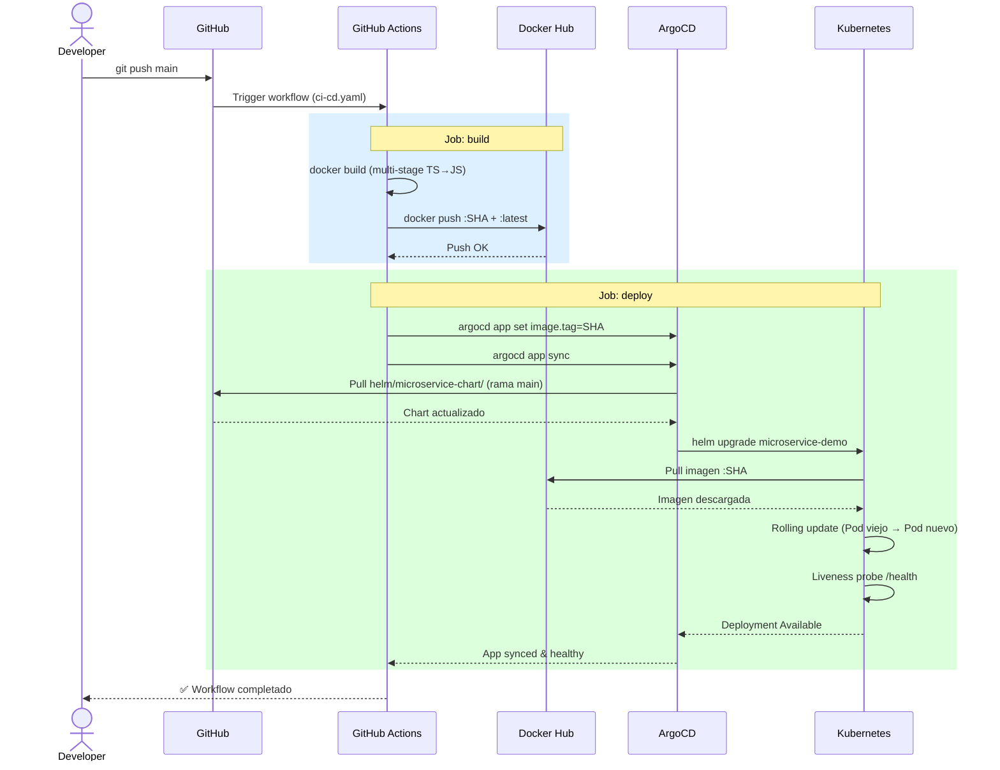

# Diagrama de Flujo – Pipeline CI/CD

Muestra el flujo completo desde el commit del developer hasta el pod corriendo en Kubernetes.

```mermaid
flowchart TD
  DEV([👨‍💻 Developer\ngit push a main])

  DEV --> GH_TRIGGER

  subgraph GH["GitHub Actions"]
    GH_TRIGGER{{"¿Cambió microservice/\no helm/ o ci-cd.yaml?"}}

    subgraph JOB_BUILD["Job: build"]
      B1[Checkout código]
      B2[Setup Docker Buildx]
      B3[Login a Docker Hub]
      B4[Extraer metadata\ntag = SHA corto]
      B5[docker build\nmulti-stage TS→JS]
      B6[docker push\nDocker Hub]
      B1 --> B2 --> B3 --> B4 --> B5 --> B6
    end

    subgraph JOB_DEPLOY["Job: deploy\n(necesita build)"]
      D1[Instalar ArgoCD CLI]
      D2[argocd login]
      D3[argocd app set\nimage.tag=SHA]
      D4[argocd app sync]
      D5[argocd app wait\nhealth OK]
      D1 --> D2 --> D3 --> D4 --> D5
    end

    GH_TRIGGER -- Sí --> JOB_BUILD
    GH_TRIGGER -- No --> SKIP([⏭ Pipeline omitido])
    JOB_BUILD --> JOB_DEPLOY
  end

  subgraph K8S["Kubernetes Cluster"]
    ARGO[ArgoCD\napplication-controller]
    HELM[Helm upgrade\nmicroservice-demo]
    ROLLING[Rolling update\nzero-downtime]
    PROBE{Liveness &\nReadiness probe\n/health}
    POD_OK([✅ Pods healthy])
    POD_FAIL([❌ Rollback automático])

    ARGO --> HELM --> ROLLING --> PROBE
    PROBE -- OK --> POD_OK
    PROBE -- Falla --> POD_FAIL
  end

  JOB_DEPLOY --> ARGO
```

---

# Diagrama de Secuencia – Deploy completo

```mermaid
sequenceDiagram
  actor Dev as Developer
  participant GH as GitHub
  participant GA as GitHub Actions
  participant DH as Docker Hub
  participant AC as ArgoCD
  participant K8s as Kubernetes

  Dev->>GH: git push main
  GH->>GA: Trigger workflow (ci-cd.yaml)

  rect rgb(220, 240, 255)
    Note over GA,DH: Job: build
    GA->>GA: docker build (multi-stage TS→JS)
    GA->>DH: docker push :SHA + :latest
    DH-->>GA: Push OK
  end

  rect rgb(220, 255, 220)
    Note over GA,K8s: Job: deploy
    GA->>AC: argocd app set image.tag=SHA
    GA->>AC: argocd app sync
    AC->>GH: Pull helm/microservice-chart/ (rama main)
    GH-->>AC: Chart actualizado
    AC->>K8s: helm upgrade microservice-demo
    K8s->>DH: Pull imagen :SHA
    DH-->>K8s: Imagen descargada
    K8s->>K8s: Rolling update (Pod viejo → Pod nuevo)
    K8s->>K8s: Liveness probe /health
    K8s-->>AC: Deployment Available
    AC-->>GA: App synced & healthy
  end

  GA-->>Dev: ✅ Workflow completado
```
