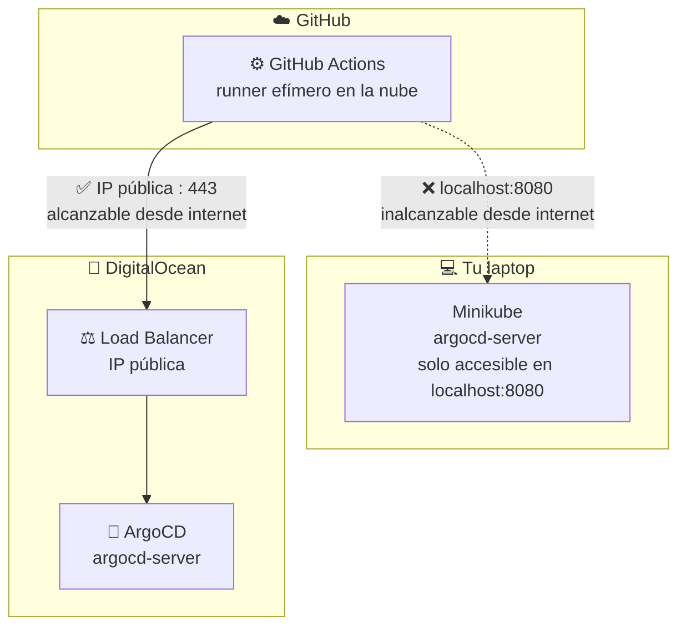
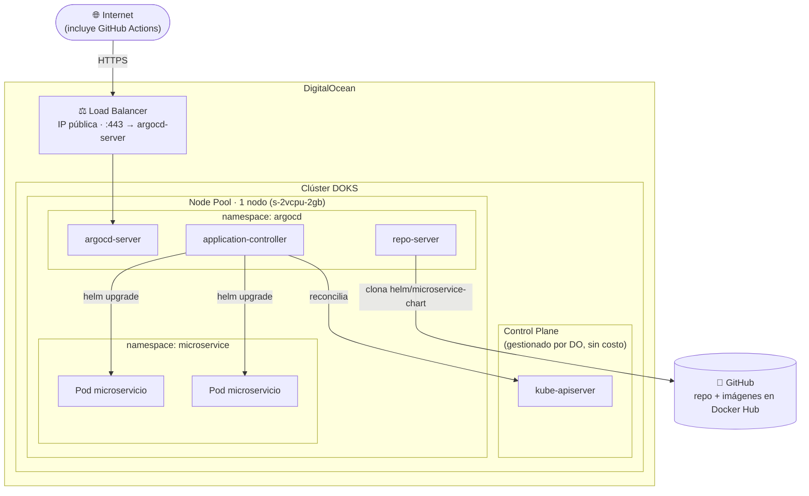
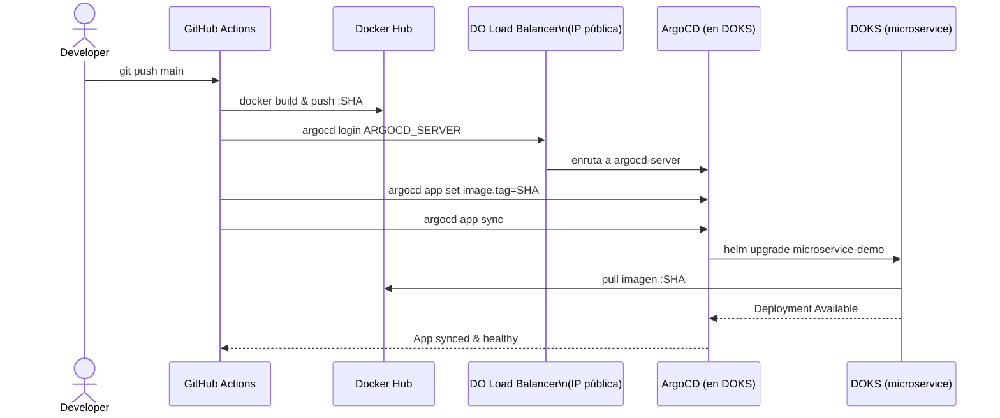

# Local vs Nube – por qué migrar ArgoCD

El job `deploy` de GitHub Actions corre en un runner **en la nube de GitHub**, no en tu computador. No puede alcanzar un ArgoCD que solo vive en minikube (`localhost`); sí puede alcanzar uno con IP pública en DigitalOcean.

---

# Infraestructura DOKS – detalle

Cómo queda ArgoCD y el microservicio una vez migrados a DigitalOcean Kubernetes (ver [`docs/despliegue-digitalocean.md`](../docs/despliegue-digitalocean.md)).

---

# Secuencia completa – GitHub Actions → DigitalOcean

