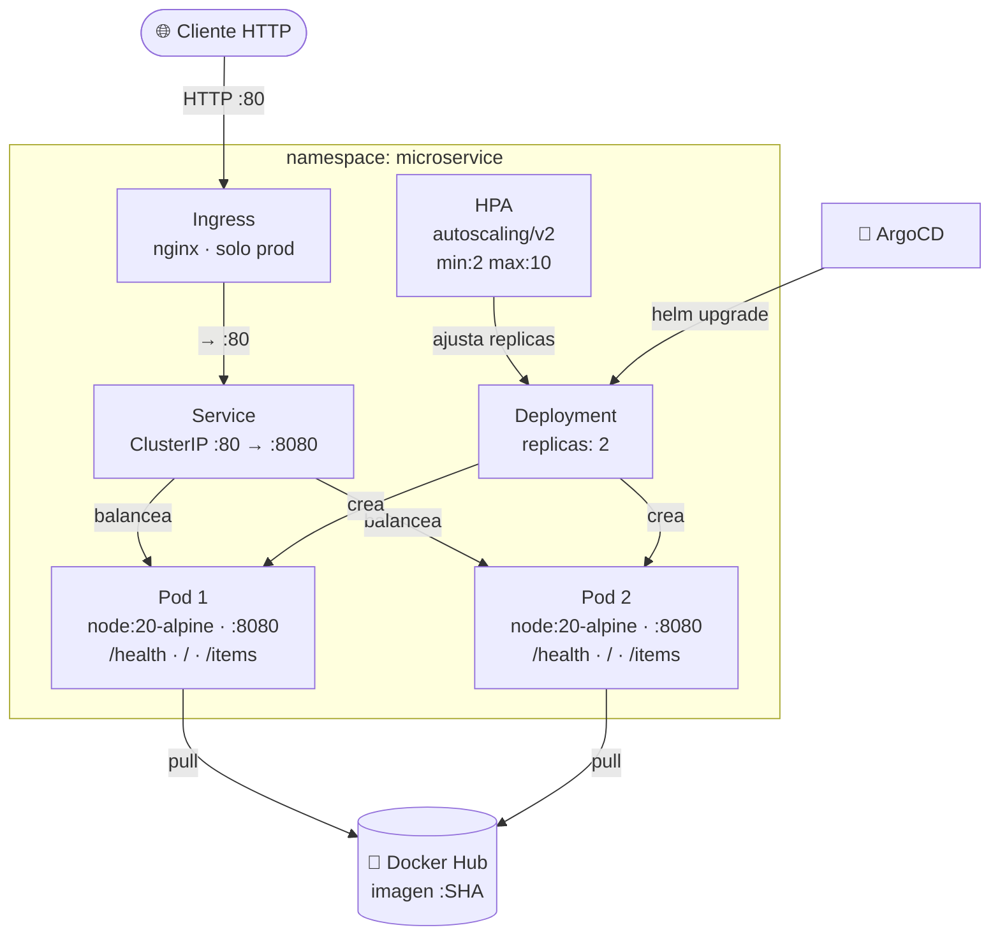
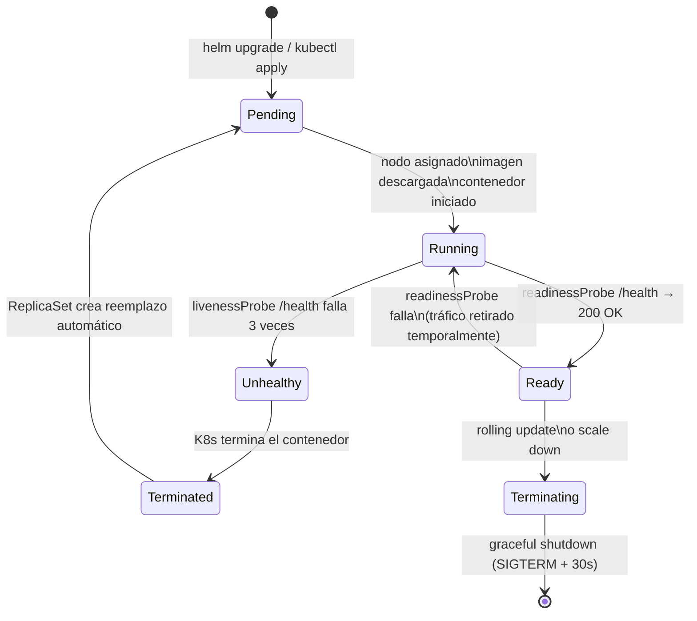
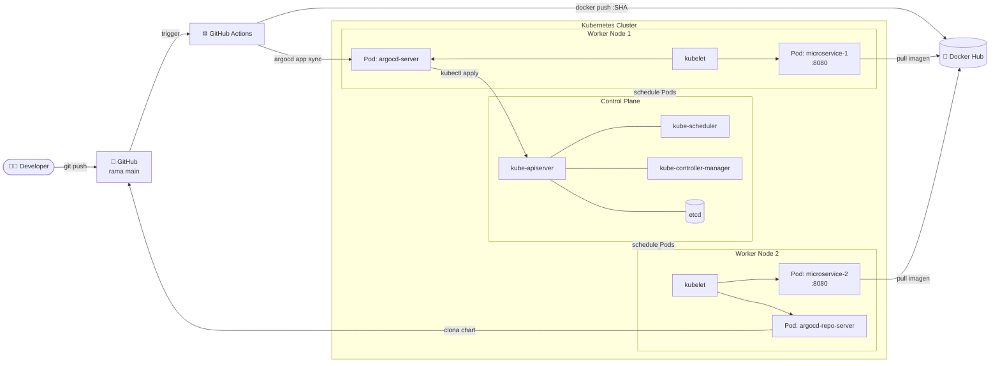

# Componentes Kubernetes – Helm Chart

Todos los objetos que crea `helm install microservice-demo` y sus relaciones.

---

# Ciclo de vida de un Pod

Estados por los que pasa un Pod desde su creación hasta su eliminación.

---

# Infraestructura de Despliegue

Distribución de los componentes entre nodos del clúster.

