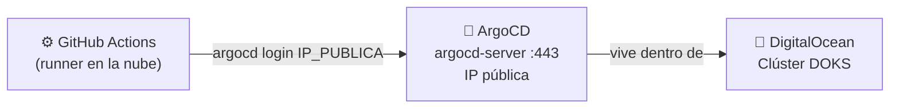

# Desplegar ArgoCD en un clúster real (DigitalOcean Kubernetes)

> Objetivo: mover ArgoCD de minikube (local, sin IP pública) a un clúster de Kubernetes gestionado en DigitalOcean (**DOKS**), que sí tiene una IP pública alcanzable desde internet — así el job `deploy` de [.github/workflows/ci-cd.yaml](../.github/workflows/ci-cd.yaml) puede conectarse de verdad, tal como pasaría en un entorno productivo.

## Por qué esto resuelve el problema

Con minikube, `ARGOCD_SERVER` solo podía ser `localhost` — inalcanzable desde los runners de GitHub Actions (máquinas en la nube de GitHub). Con DOKS, el clúster completo vive en la nube de DigitalOcean con una IP pública real: `ARGOCD_SERVER` pasa a ser esa IP, y GitHub Actions se conecta a ella igual que se conectaría cualquier cliente desde internet.



## 0. Costos (léelo antes de crear nada)

DigitalOcean **no cobra por el control plane** de Kubernetes (a diferencia de AWS EKS), solo por lo que uses:

| Recurso | Costo aproximado |
|---|---|
| 1 nodo worker (`s-2vcpu-2gb`) | ~$18 USD/mes → prorrateado por hora (~$0.025/h) |
| Load Balancer (para exponer ArgoCD) | ~$12 USD/mes → prorrateado por hora (~$0.017/h) |

Con tus créditos gratis esto es prácticamente cero si lo usas solo durante el ejercicio, **pero hay que borrar el clúster y el Load Balancer cuando termines** (Sección 8) para no seguir consumiendo créditos día tras día. Verifica los precios actuales en el [pricing de DigitalOcean](https://www.digitalocean.com/pricing/kubernetes), pueden cambiar.

---

## 1. Crear cuenta y reclamar créditos

1. Crea tu cuenta en [digitalocean.com](https://www.digitalocean.com/) (o entra si ya tienes).
2. Aplica tu promoción/créditos (por ejemplo, si tienes el [GitHub Student Developer Pack](https://education.github.com/pack), incluye créditos de DigitalOcean).
3. DigitalOcean pide un método de pago aunque tengas créditos — es normal, solo se cobra si te quedas sin crédito.

## 2. Instalar y autenticar `doctl` (CLI de DigitalOcean)

```bash
brew install doctl
```

Genera un **Personal Access Token**: dashboard de DigitalOcean → **API** → **Generate New Token** (dale permisos de lectura/escritura), luego:

```bash
doctl auth init
# pega el token cuando te lo pida
```

## 3. Crear el clúster DOKS

```bash
doctl kubernetes cluster create microservice-demo \
  --region nyc1 \
  --node-pool "name=pool1;size=s-2vcpu-2gb;count=1" \
  --wait
```

- `--region nyc1` → elige la región más cercana a ti si quieres (`doctl kubernetes options regions` para ver todas).
- `count=1` → un solo nodo alcanza para este ejercicio.
- Al terminar, `doctl` **configura automáticamente tu `kubectl`** con un nuevo contexto apuntando al clúster remoto.

Verifica que `kubectl` ya está hablando con el clúster de DigitalOcean y no con minikube:

```bash
kubectl config current-context
# doctl-nyc1-microservice-demo

kubectl get nodes
# debería mostrar 1 nodo con un nombre tipo pool1-xxxxx
```

> Tu minikube local **no desaparece**, solo queda como otro contexto. Para volver a él más adelante: `kubectl config get-contexts` y luego `kubectl config use-context minikube`.

## 4. Instalar ArgoCD en el clúster remoto

Es el mismo script que ya usaste en local — como `kubectl` ahora apunta a DOKS, se instala ahí:

```bash
./argocd/install-argocd.sh
```

## 5. Exponer `argocd-server` con una IP pública real

Por defecto el `Service` de ArgoCD es `ClusterIP` (solo accesible dentro del clúster, como en minikube). En DOKS lo cambiamos a `LoadBalancer`, y DigitalOcean crea automáticamente un balanceador de carga real con IP pública:

```bash
kubectl patch svc argocd-server -n argocd -p '{"spec": {"type": "LoadBalancer"}}'
```

Espera a que DigitalOcean le asigne la IP (tarda 1-2 minutos):

```bash
kubectl get svc argocd-server -n argocd --watch
# EXTERNAL-IP pasa de <pending> a una IP real, ej: 143.198.xxx.xxx
# Ctrl+C cuando aparezca la IP
```

## 6. Obtener la contraseña del admin (en este clúster nuevo)

```bash
kubectl get secret argocd-initial-admin-secret -n argocd \
  -o jsonpath="{.data.password}" | base64 -d && echo
```

> Es una contraseña **distinta** a la que generaste en minikube — cada instalación de ArgoCD genera la suya.

## 7. Probar el login manualmente antes de tocar GitHub

```bash
argocd login <EXTERNAL-IP> --username admin --password <PASSWORD> --insecure
```

`--insecure` sigue siendo necesario aquí porque ArgoCD usa un certificado autofirmado por defecto (no tienes un dominio + Let's Encrypt configurado) — es habitual en una prueba de concepto, aunque en un entorno productivo real se reemplaza por un `Ingress` con TLS válido.

Agrega el repo y aplica el `Application` (igual que en el Paso 5 del README, pero ahora contra este clúster):

```bash
argocd repo add https://github.com/MAS-SABANA/MAS-01-ARQ-03-K8S.git
kubectl apply -f argocd/application.yaml
argocd app sync microservice-demo
argocd app get microservice-demo
```

## 8. Configurar los secrets en GitHub

**Settings → Secrets and variables → Actions**:

| Secret | Valor |
|---|---|
| `ARGOCD_SERVER` | `<EXTERNAL-IP>` (solo la IP, sin `https://` ni puerto) |
| `ARGOCD_PASSWORD` | la contraseña del paso 6 |

`DOCKERHUB_USERNAME` y `DOCKERHUB_TOKEN` ya los tenías configurados — no cambian.

## 9. Probar el pipeline completo

Haz un cambio pequeño en `microservice/` (por ejemplo un texto en `/health`) y haz `git push` a `main`. El job `build` construye y publica la imagen; el job `deploy` ahora sí puede conectarse a tu `ARGOCD_SERVER` real y hacer `argocd app sync` de verdad, desde un runner en la nube de GitHub hacia tu clúster en la nube de DigitalOcean.

Verifica el resultado apuntando `curl` a la IP pública del `Service` de tu microservicio (no al de ArgoCD):

```bash
kubectl get svc -n microservice
```

---

## 10. IMPORTANTE — Borrar todo cuando termines (para no gastar créditos)

```bash
# Borra el clúster completo (nodos + control plane)
doctl kubernetes cluster delete microservice-demo

# Verifica que el Load Balancer también se haya eliminado
doctl compute load-balancer list
# si queda alguno huérfano, bórralo:
doctl compute load-balancer delete <LB-ID>
```

Confirma en el [panel web de DigitalOcean](https://cloud.digitalocean.com/kubernetes/clusters) → **Kubernetes** y **Networking → Load Balancers** que no quede nada corriendo.

---

## Resumen: minikube vs DOKS

| | Minikube (local) | DOKS (DigitalOcean) |
|---|---|---|
| Dónde vive | Tu laptop | La nube de DigitalOcean |
| IP pública | No tiene | Sí (vía `LoadBalancer`) |
| GitHub Actions puede conectarse | ❌ No | ✅ Sí |
| Costo | Gratis | ~$0.04 USD/hora mientras esté encendido |
| Uso típico | Desarrollo/aprendizaje | Producción / demo real de CI/CD |
